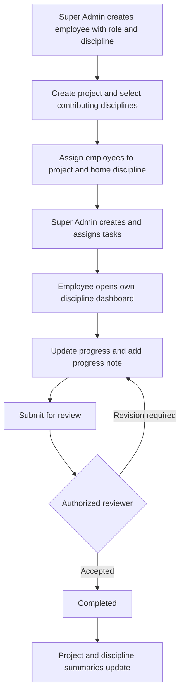

# Project Monitoring ? Discipline Workflow

Super Admin ang may kontrol sa employees, disciplines, projects, contributors, at task assignments. Ang ibang user ay gumagalaw lamang sa sarili nilang discipline at sa assigned projects, ayon sa role permissions.

**Release status (2026-09-17):** the consultancy, event-trigger hardening and discipline-control migrations are now applied to the live Supabase project. The project-save function was verified under the authenticated Super Admin database role inside a rolled-back transaction, and the API schema cache was refreshed. No verification project was retained. Full live browser/Auth/Storage acceptance remains a rollout check. See [deployment guide](docs/DEPLOYMENT.md).

## Daily workflow

## Employee accounts

- Landing page: sign-in only; no public registration.
- Super Admin ? Control Center ? **Employee management**.
- Required: full name, valid email, role, discipline and position. Choose active/inactive status.
- Account creation returns a one-time password setup link for private sharing. It does not send email automatically. `APP_ORIGIN` and a server-only Auth admin key must be configured.
- The database accepts new Auth users only with an unexpired, single-use invitation reservation created by a Super Admin. Supplying privileged user metadata cannot grant access.
- Search employees and filter by discipline, role, position and account status. Details show project assignments.
- Role, discipline, status and access-reset changes require confirmation. Only Super Admin may create or modify employee accounts.
- Existing accounts are preserved. Assign a home discipline and project membership to existing non-Super-Admin accounts before rollout.

## Disciplines and projects

1. Maintain the **Disciplines** register. Names are loaded from the database; adding a discipline needs no frontend code change.
2. Create a project with code, client, type, location, dates, status and description.
3. Select **Contributing disciplines** on the project form. Saving the project and contributor selection is one database transaction.
4. Add employees in **Project teams**. Their assigned discipline must match their active home discipline and an active project contributor.
5. A designated manager/architect receives membership within their home discipline. Discipline leads can be assigned in Project disciplines.
6. Project details show only active contributors and their computed completion. Overall completion is the equal-weight average across active disciplines; a contributor with no tasks contributes 0%. Cancelled tasks do not contribute to discipline completion.

Removing a contributor deactivates its record and revokes employee access; it preserves historical work. Disabling a discipline also revokes access. Changing an employee's discipline never transfers old tasks automatically. Super Admin must review memberships and reassign affected tasks. Remove obsolete designated manager/lead memberships explicitly.

## Tasks and progress

**Assigned ? In progress ? For review ? Completed**, with Blocked and Revision required as needed. The stored initial status remains `not_started` for compatibility.

- Only Super Admin creates tasks or changes title/instructions, discipline assignment, employee assignment, priority, dates and task relationships.
- Employee can view their discipline's authorized tasks and update their own assigned tasks: status, percentage and progress note.
- Discipline Leads/Managers can update permitted tasks within their own discipline when their global and project role grants allow it.
- Reviewer permission is required for approval/completion, revision requests and cancellation.
- Progress may reach 100% before review, but 100% does not automatically mark a task Completed. Completed forces 100%; Assigned forces 0%.
- Task history records previous/new values, who changed them and when. Progress notes have their own history entries; audit records capture before/after data.
- Task dependencies, comments, deliverable revision approvals, private documents, RFIs and coordination issues remain available within the same discipline boundaries.

## Access rules

| Role                                | Allowed scope                                                                              |
| ----------------------------------- | ------------------------------------------------------------------------------------------ |
| Super Admin                         | All system data, accounts, roles, contributors and assignments.                            |
| Discipline Lead / Manager           | Own active discipline within assigned projects, subject to global and project role grants. |
| Employee / Team Member / Consultant | Own discipline's permitted records; assigned-task progress, status and notes.              |
| Viewer / Client                     | Own assigned discipline's permitted read/review access.                                    |
| Legacy Admin                        | No organization-wide employee administration; discipline and membership rules apply.       |

Global profile discipline is always checked. A legacy whole-project membership or permission override cannot open another discipline or delegate reserved Super Admin operations. Checks apply in the UI, server actions and RLS, including direct API calls. Inactive accounts have no protected data access.

## Dashboards and notifications

Employees land on `/portal`, headed with their own discipline name. It shows assigned projects, work, percentages, deadlines, overdue counts, discipline summary and recent task history. `/admin` is the Super Admin Control Center. The task board remains available at `/?view=board`.

Notifications cover new assignments, reassignment, changed instructions/deadlines/status and revision requests. Unassigned discipline tasks notify active project members in that discipline. Approaching/overdue reminders are generated when the notification center opens, not by a background scheduler. Notification reads still obey current access permissions.

The supplied requirements end midway through the final notification bullet after ?Super?; no additional behavior has been inferred from that incomplete bullet.

## Verification

Run `npm run lint`, `npm run build`, and `npm run test:db`. See [implementation details](docs/IMPLEMENTATION.md) for the distinction between local database/browser verification and live rollout checks.
