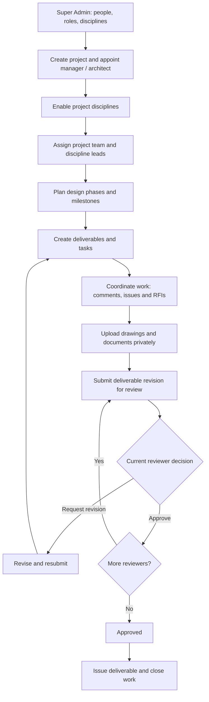
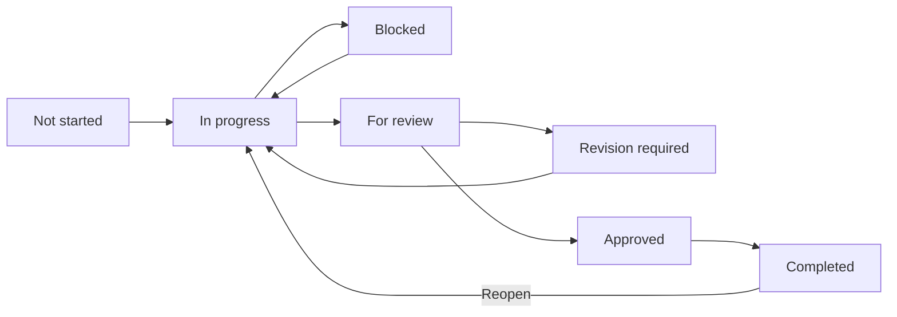

# Project Monitor — Consultancy Workflow

Ang system ay para sa multi-project, multi-discipline A&E consultancy. May existing task board sa `/`, consultancy dashboard sa `/portal`, at protected Control Center sa `/admin`.

**Deployment status (2026-09-17):** platform migration applied to Supabase project `hskgapqvsweuljueenig` after schema inspection. The requested Super Admin account was created and its active role verified; login initially required email confirmation. Application deployment and remaining live acceptance checks are pending. The follow-up `restrict_rls_event_trigger` migration is prepared locally but not yet applied. See [deployment instructions](docs/DEPLOYMENT.md).

## Project lifecycle

## 1. Super Admin setup

1. Create and confirm the initial account through Supabase Auth.
2. A trusted operator runs the one-time bootstrap. It refuses to run if a Super Admin already exists.
3. Open `/admin` → People & consultants.
4. Create accounts, share one-time setup links privately, assign global roles, and activate/disable users. Passwords are handled only by Supabase Auth.
5. Maintain the central discipline directory. Existing combined disciplines are preserved; additional A&E disciplines are seeded without merging historical records.

New accounts start as Viewer and have no project access until explicitly assigned. The create-account action generates an access link; it does not send an email automatically.

## 2. Set up a project

1. **Projects:** add code, name, client, description, type, location, design status, dates, manager, architect, priority, contract details, and optional value.
2. **Project disciplines:** enable the disciplines required by that project.
3. **Project teams:** assign people to project roles. A blank discipline means whole-project access; selecting a discipline limits that membership to it.
4. Assign discipline leads. The designated lead receives a matching project membership.
5. **Design phases / Milestones:** plan the stages, responsible people, targets, and progress.

A person's global title does not automatically make them a member of every project. Project-specific memberships determine their access. Super Admin and permitted organization Admin operations are exceptions.

Changing a designated manager or lead adds the new assignment. Remove obsolete team memberships explicitly in Project teams so access is not revoked accidentally.

## 3. Task workflow

- Create tasks with discipline, assignee, priority, start/due dates, description, and progress.
- Link tasks to a phase, milestone, deliverable, or parent task in **Task register**.
- Add predecessor tasks and comments through task details. Circular dependencies and cross-project references are rejected.
- A reviewer permission is required to mark a task Approved or Completed. Configurable multistep approval is implemented for deliverables, not individual tasks.
- Incomplete predecessors prevent approval/completion.
- Completed sets progress to 100%; Not started sets it to 0%. Reopening a completed task resets progress to 0%.
- Cancelled remains available for history and is excluded from overdue/open-task counts.
- The original table/Kanban board, My work, search, history, and realtime task refresh remain available. Board and registers paginate results.

**Daily routine:** My work → prioritize overdue/critical items → update progress/comments → raise blockers → submit work for review.

## 4. Deliverables, documents, and approvals

1. Create a deliverable with type, discipline, owner, revision, target, phase, and milestone.
2. Upload supporting files through **Documents**. Set the document number, revision, type, and related deliverable/task/RFI/issue.
3. Files are stored in the private `project-documents` bucket. Download requests check current access and issue a 60-second download URL.
4. In **Approval workflows**, configure a workflow for the project and deliverable type.
5. Add numbered reviewers through **Workflow reviewers**. Reviewers must be active and authorized for the project/discipline.
6. Open **Approval queue**, select the project, deliverable, and workflow, then submit.
7. The submission snapshots its ordered review steps. Only the current reviewer can approve or request revision.
8. Rejection closes that submission as rejected; update the deliverable revision and submit a new review. Prior decisions remain available.
9. Approved/Issued requires an approved workflow for the current revision. Submitted content cannot be silently rewritten under the same revision.

Document revisions are separate records. Use Superseded or Archived to retire records. The current UI does not permanently delete registered files or approval history.

## 5. Coordination

- **RFIs:** record the question, discipline, assignee, priority, and required response date. The assignee can submit a response; managers can coordinate closure.
- **Issues:** record severity, owner, target, resolution, and comments. Use Critical for coordination blockers requiring immediate attention.
- **Documents:** attach supporting files to tasks, deliverables, RFIs, or issues.

## 6. Roles and access

| Role                                | Baseline behavior                                                                                                                                        |
| ----------------------------------- | -------------------------------------------------------------------------------------------------------------------------------------------------------- |
| Super Admin                         | Full platform administration and project access.                                                                                                         |
| Admin                               | Organization administration within granted permissions; cannot manage Super Admin accounts, change roles, or access reserved settings/audit permissions. |
| Project Manager / Project Architect | Manage assigned project work and teams within their membership scope.                                                                                    |
| Discipline Lead                     | Manage work in assigned disciplines; cannot edit the whole project solely through a discipline membership.                                               |
| Consultant / Team Member            | View authorized discipline work; update assigned tasks and deliverables, comment, upload permitted files, and respond to assigned RFIs.                  |
| Client                              | Read authorized project information and decide assigned approval steps.                                                                                  |
| Viewer                              | Read authorized project information; no protected data changes.                                                                                          |

Roles are database records mapped to permissions. Custom roles can be added and assigned to project memberships. Project overrides allow or deny specific permissions for a member; they do not grant membership by themselves. Global roles and project roles are separate responsibilities.

For a discipline-scoped user creating records in a register, select both the project and discipline filter. The task board also offers authorized disciplines directly.

## 7. Monitoring and audit

- Dashboard: accessible projects, open RFIs, critical issues, overdue work, milestones, my tasks/deliverables, discipline progress, notifications, and admin summaries.
- Reports: all authorized records are aggregated in the database, independently of table pagination.
- Search: projects, tasks, deliverables, RFIs, issues, documents, and visible people.
- Notifications: assignments, work status changes, RFI responses, project updates, approval requests/decisions, and deadlines.
- Deadline reminders refresh when the notification center opens. They are not background email/SMS reminders.
- Audit log: database changes, role/permission changes, account creation/access-reset actions, bootstrap, and successful application login/logout events. Normal authenticated users cannot insert, rewrite, or delete audit rows.

## Verification and limits

See [implementation and verification details](docs/IMPLEMENTATION.md). Lint, production build, local PostgreSQL/RLS tests, and isolated browser checks were run. Live Auth, live Storage transport, realtime connectivity, and production rollout still require verification with the authorized Supabase project.

The foundation does not include email delivery, external consultant federation, full-text search ranking, antivirus scanning, PDF/Excel export, or a general-purpose workflow rules engine.
